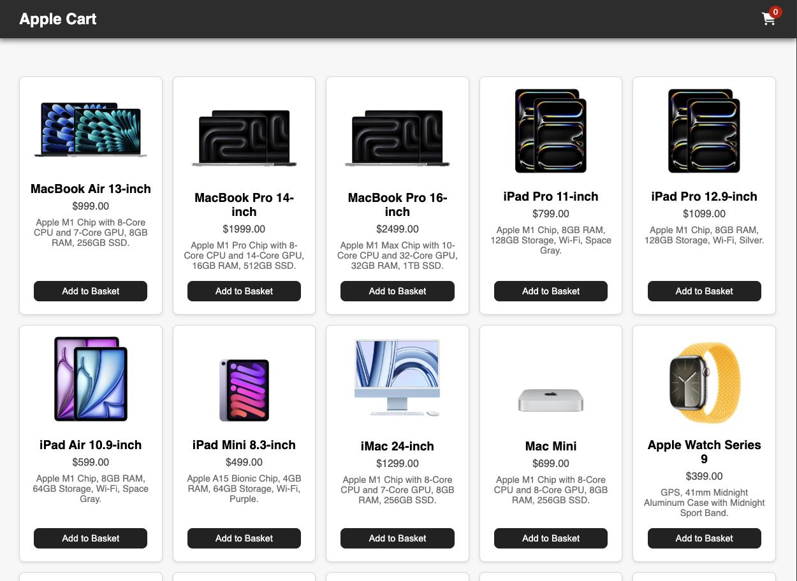

# AppleCart UI

AppleCart is a responsive e-commerce website UI using HTML, SCSS, Vite, and JavaScript.

## Tech Stack
- HTML
- SCSS
- Vite
- Javascript

Features flexbox responsive flow, add to cart, remove from cart, and increase/decrease count within cart.

## Credit
Built by Heather Hugo.  
Inspired by thehashton's [Apple Cart UI](https://github.com/thehashton/applecart-ui).